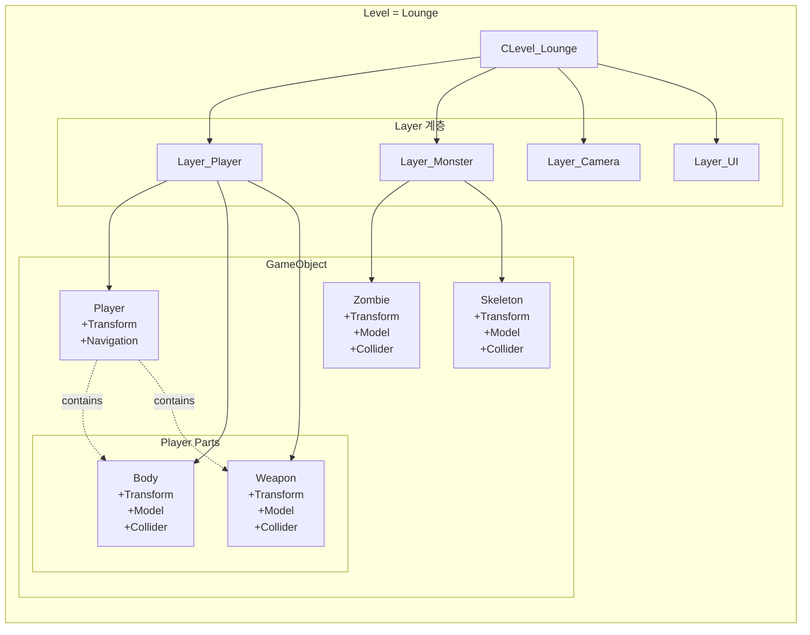
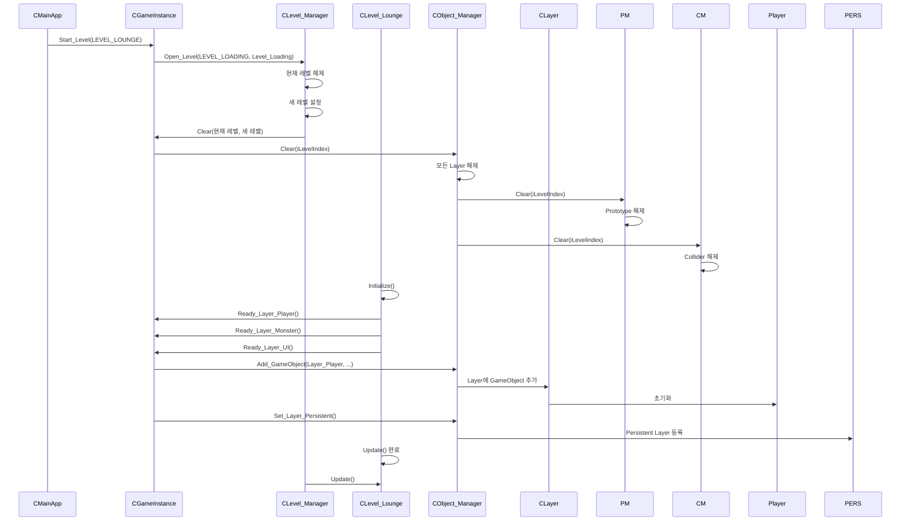
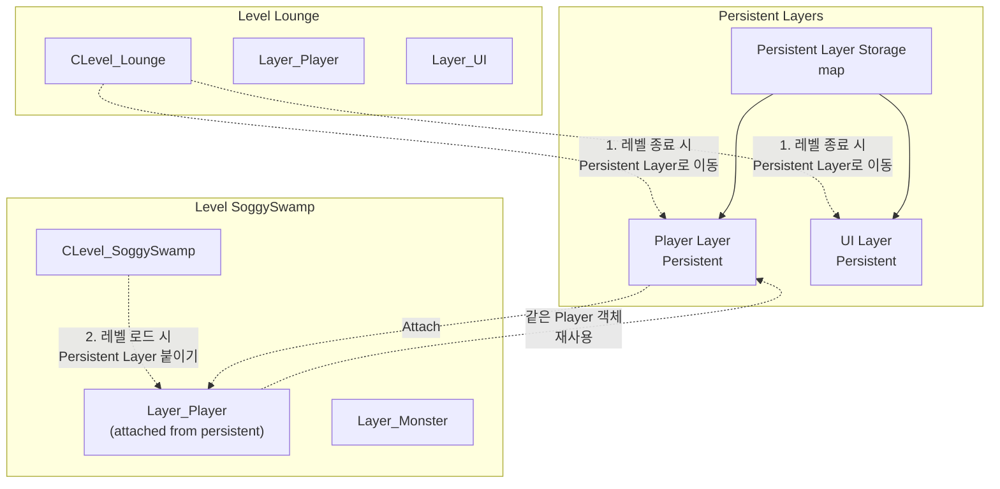
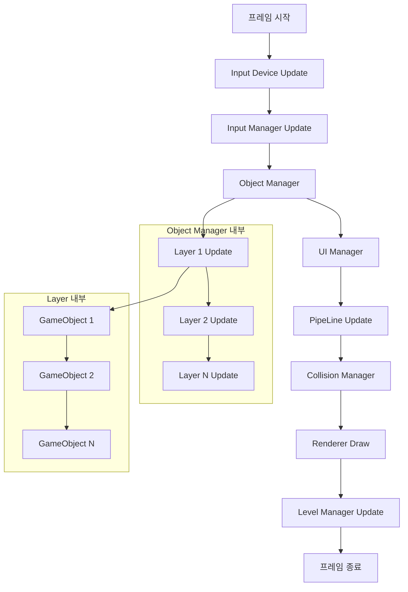
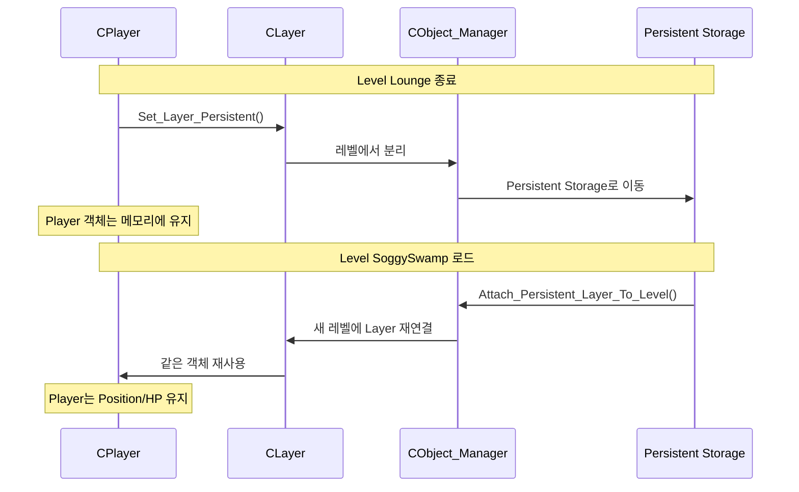

# 전체 아키텍처 흐름 다이어그램

## 전체 시스템 아키텍처

```mermaid
graph TB
    subgraph "Application Layer"
        APP[CMainApp]
        WND[Window Message Loop]
    end
    
    subgraph "GameInstance - 중앙 관리자"
        GI[CGameInstance<br/>Singleton]
        
        subgraph "Sub Managers"
            GM[Graphic Device]
            IM[Input Device/Manager]
            TM[Timer Manager]
            PM[Prototype Manager]
            OM[Object Manager]
            REN[Renderer]
            PL[PipeLine]
            LM[Light Manager]
            UM[UI Manager]
            CM[Collision Manager]
            PICK[Picking]
            EB[EventBus]
        end
    end
    
    subgraph "Level System"
        LMGR[CLevel_Manager]
        
        subgraph "Current Level"
            L1[CLevel_Lounge]
            L2[CLevel_Loading]
            L3[CLevel_SoggySwamp]
        end
    end
    
    subgraph "Object Manager - Level별 관리"
        OMGR[CObject_Manager]
        
        subgraph "Level별 Layer 구조"
            LYRMAP1["Level 0: map<LayerTag, CLayer*>"]
            LYRMAP2["Level 1: map<LayerTag, CLayer*>"]
            LYRMAPN["Level N: map<LayerTag, CLayer*>"]
        end
        
        PERS["Persistent Layers<br/>map<LayerTag, CLayer*>"]
    end
    
    subgraph "Layer - GameObject 계층"
        LYR1["CLayer: Player"]
        LYR2["CLayer: Monster"]
        LYR3["CLayer: Camera"]
        LYR4["CLayer: UI"]
    end
    
    subgraph "GameObject 계층"
        GO[CGameObject<br/>abstract]
        
        CO[CContainerObject<br/>abstract]
        PO[CPartObject<br/>abstract]
        
        PLY[CPlayer]
        MST[CMonster]
        ITM[CItem]
        BODY[CBody_Player]
        WPN[CWeapon]
        
        PLY --> CO
        MST --> CO
        ITM --> PO
        BODY --> PO
        WPN --> PO
        CO --> GO
        PO --> GO
    end
    
    subgraph "Component 시스템"
        COM[CComponent<br/>abstract]
        
        TF[CTransform]
        COL[CCollider]
        NAV[CNavigation]
        MDL[CModel]
        SH[CShader]
        TX[CTexture]
        VIB[CVIBuffer]
        
        COM --> TF
        COM --> COL
        COM --> NAV
        COM --> MDL
        COM --> SH
        COM --> TX
        COM --> VIB
    end
    
    subgraph "상속 관계"
        CO --> |"contains"| PO
        GO --> |"has-many"| COM
        PO --> |"has-many"| COM
    end
    
    subgraph "관리 관계"
        APP --> GI
        GI --> GM
        GI --> IM
        GI --> TM
        GI --> PM
        GI --> OM
        GI --> REN
        GI --> PL
        GI --> LM
        GI --> UM
        GI --> CM
        GI --> PICK
        GI --> EB
        GI --> LMGR
        GI --> OMGR
        
        LMGR --> L1
        LMGR --> L2
        LMGR --> L3
        
        OMGR --> LYRMAP1
        OMGR --> LYRMAP2
        OMGR --> LYRMAPN
        OMGR --> PERS
        
        LYRMAP1 --> LYR1
        LYRMAP1 --> LYR2
        LYRMAP1 --> LYR3
        LYRMAP1 --> LYR4
        
        LYR1 --> PLY
        LYR2 --> MST
        LYR4 --> ITM
        
        PLY --> |"contains"| BODY
        PLY --> |"contains"| WPN
        PLY --> |"has"| TF
        PLY --> |"has"| NAV
        
        BODY --> |"has"| TF
        BODY --> |"has"| MDL
        BODY --> |"has"| COL
        
        WPN --> |"has"| TF
        WPN --> |"has"| MDL
        WPN --> |"has"| COL
        
        MST --> |"has"| TF
        MST --> |"has"| MDL
        MST --> |"has"| COL
        
        COL --> CM
        REN --> PLY
        REN --> MST
```

---

## Layer-Object 구조 상세



---

## 레벨 전환 흐름



---

## Persistent Layer 시스템



---

## 전체 업데이트 흐름



---

## 핵심 계층 구조

```
┌────────────────────────────────────────────────────────┐
│                  CMainApp (Application)                  │
└────────────────────────┬───────────────────────────────┘
                         │
┌────────────────────────▼───────────────────────────────┐
│              CGameInstance (Singleton)                   │
│  - Graphic Device, Input, Timer, Prototype Managers    │
│  - Object Manager, Renderer, Collision Manager         │
│  - Level Manager, UI Manager                            │
└────────────────────────┬───────────────────────────────┘
                         │
         ┌───────────────┴───────────────┐
         │                               │
┌────────▼────────┐          ┌──────────▼─────────┐
│ Level Manager   │          │  Object Manager    │
│  - 현재 레벨 관리  │          │  - Level별 Layer관리  │
│  - 레벨 전환 제어  │          │  - Persistent Layer │
└────────┬────────┘          └──────────┬─────────┘
         │                             │
┌────────▼────────┐          ┌──────────▼─────────┐
│ Current Level   │          │     CLayer         │
│ (Lounge/Swamp)  │          │  - GameObject 그룹│
│                 │          └──────────┬─────────┘
│ Ready_Layer_*() │                   │
└─────────────────┘          ┌──────────▼─────────┐
                             │   CGameObject      │
                             │  - Components      │
                             │    ├─ Transform    │
                             │    ├─ Collider     │
                             │    └─ Model        │
                             └──────────┬─────────┘
                                        │
                        ┌───────────────┴───────────────┐
                        │                               │
               ┌────────▼────────┐          ┌──────────▼─────────┐
               │ ContainerObject │          │    PartObject      │
               │  (Player, etc) │          │  (Body, Weapon)   │
               │                │          │                    │
               │ contains       │◄─────────┤  refers to parent  │
               │                │          │                    │
               └────────────────┘          └────────────────────┘
```

---

## 데이터 흐름 (프레임 단위)

```
1. INPUT PHASE
   CMainApp
   ↓
   CGameInstance → Input Device/Manager
   ↓
   Key 상태 업데이트

2. LOGIC PHASE
   CGameInstance → Object Manager
   ↓
   Level별 모든 Layer 순회
   ↓
   각 Layer의 GameObject 순회
   ↓
   GameObject → Priority Update / Update / Late Update
   ↓
   각 Component Update (Transform, Collider, Navigation 등)

3. PHYSICS PHASE
   Collision Manager
   ↓
   활성화된 Collider만 순회
   ↓
   충돌 검사 및 이벤트 전달
   ↓
   GameObject.Collided_With() 호출

4. RENDER PHASE
   Renderer
   ↓
   Render Group별 정렬
   ↓
   GameObject.Render() 호출
   ↓
   Component.Render() (Model, Shader, Texture 등)

5. UI PHASE
   UI Manager
   ↓
   UI GameObject Render

6. LEVEL PHASE
   Level Manager
   ↓
   Current Level.Update()
```

---

## Persistent Layer 동작 원리



---

## Level-Layer-Object 관계

```
LEVEL
  └─ LAYERS (map<LayerTag, CLayer*>)
       └─ OBJECTS (map<ObjectTag, CGameObject*>)
            └─ COMPONENTS (map<ComponentTag, CComponent*>)
                 ├─ Transform
                 ├─ Model
                 ├─ Collider
                 └─ Navigation
```

---

## Layer별 역할

| Layer | 역할 | GameObject 예시 |
|-------|------|----------------|
| Layer_Player | 플레이어 캐릭터 | Player, Body, Weapon, Armor |
| Layer_Monster | 적 캐릭터 | Zombie, Skeleton, Slime |
| Layer_Camera | 카메라 | Free Camera |
| Layer_Background | 배경 | Sky, Map |
| Layer_UI | UI 오브젝트 | HP Bar, Inventory |
| Layer_Trigger | 트리거/이벤트 | Level Trigger |
| Layer_InventoryUI | 인벤토리 | Inventory Base, Slots |
| Layer_PlayerSlotUI | 플레이어 슬롯 | Gear Slots, Artifact Slots |

---

## 핵심 설계 철학

1. **계층적 관리**: Level → Layer → GameObject → Component
2. **Persistent Layer**: 레벨 전환 시 유지해야 할 객체 보존
3. **자동 초기화**: Level.Initialize()에서 모든 Layer 준비
4. **책임 분리**: 각 Manager가 자신의 책임만 담당
5. **참조 카운팅**: 안전한 메모리 관리


